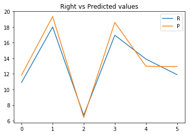

# MLPNets Demonstration

Hello! This notebook will use some cool stuff from the neural net world and demonstrate how to use the lib MLPNets.

I know you can do anything by yourself, but It is easyer to know you can relly on some good libreries, isn't?
Lets import them now.


```python
# To help us transforming and filtering our data:
from sklearn.preprocessing import scale, normalize
from sklearn.model_selection import train_test_split

# To import our file into a dataset: 
import pandas as pd

# To plot graphs like Da Vinci:
import seaborn as sb
import matplotlib.pyplot as plt
%matplotlib inline

# Our Neural Network guys
import MLPClassifier
import MLPRegressor
```

Good, we have all we need to work. Lets import and check our dataset.


```python
data = pd.read_csv("dengue_flu_illness.csv")
data.head()
```


<div>
<style scoped>
    .dataframe tbody tr th:only-of-type {
        vertical-align: middle;
    }

    .dataframe tbody tr th {
        vertical-align: top;
    }

    .dataframe thead th {
        text-align: right;
    }
</style>
<table border="1" class="dataframe">
  <thead>
    <tr style="text-align: right;">
      <th></th>
      <th>temperature</th>
      <th>body_aches</th>
      <th>head_aches</th>
      <th>diarrhea</th>
      <th>nausea</th>
      <th>coughing</th>
      <th>runny_nose</th>
      <th>has_dengue</th>
      <th>has_flu</th>
      <th>illness_score</th>
    </tr>
  </thead>
  <tbody>
    <tr>
      <th>0</th>
      <td>36.5</td>
      <td>0</td>
      <td>1</td>
      <td>0</td>
      <td>0</td>
      <td>0</td>
      <td>0</td>
      <td>0</td>
      <td>0</td>
      <td>4.65</td>
    </tr>
    <tr>
      <th>1</th>
      <td>36.5</td>
      <td>0</td>
      <td>1</td>
      <td>1</td>
      <td>0</td>
      <td>0</td>
      <td>1</td>
      <td>0</td>
      <td>0</td>
      <td>6.65</td>
    </tr>
    <tr>
      <th>2</th>
      <td>37.0</td>
      <td>0</td>
      <td>0</td>
      <td>0</td>
      <td>1</td>
      <td>0</td>
      <td>0</td>
      <td>0</td>
      <td>0</td>
      <td>4.70</td>
    </tr>
    <tr>
      <th>3</th>
      <td>37.0</td>
      <td>1</td>
      <td>1</td>
      <td>1</td>
      <td>0</td>
      <td>0</td>
      <td>0</td>
      <td>0</td>
      <td>0</td>
      <td>6.70</td>
    </tr>
    <tr>
      <th>4</th>
      <td>37.5</td>
      <td>0</td>
      <td>0</td>
      <td>2</td>
      <td>0</td>
      <td>0</td>
      <td>0</td>
      <td>0</td>
      <td>0</td>
      <td>5.75</td>
    </tr>
  </tbody>
</table>
</div>


It is a good idea to partition the data into training and test datasets.


```python
data_train, data_test = train_test_split(data, test_size=0.3)
```


```python
# Training data
y1 = data_train[["has_dengue", "has_flu"]]
y2 = data_train[["illness_score"]]
X1 = data_train.drop(columns=y1).drop(columns=y2).values
X2 = data_train.drop(columns=y2).values
y1 = y1.values
y2 = y2.values

# Testing data
ytest1 = data_test[["has_dengue", "has_flu"]]
ytest2 = data_test[["illness_score"]]
Xtest1 = data_test.drop(columns=ytest1).drop(columns=ytest2).values
Xtest2 = data_test.drop(columns=ytest2).values
ytest1 = ytest1.values
ytest2 = ytest2.values
```

Now lets create scaled and normalized versions of our dataset.


```python
# Lets try with scaled and normalized Xs
Xscaled1 = scale(X1)
Xnorm1 = normalize(X1)
Xscaled_test1 = scale(Xtest1)
Xnorm_test1 = normalize(Xtest1)

Xscaled2 = scale(X2)
Xnorm2 = normalize(X2)
Xscaled_test2 = scale(Xtest2)
Xnorm_test2 = normalize(Xtest2)
```

It is always a good idea to take a look into correlations between your data.


```python
plt.figure(figsize=[10,4])
sb.heatmap(data.corr())
plt.show()
```


## The Classifier

Here we are going to create a classifier, with 2 boolean outputs:


```python
# X Shape: 5,n - Y Shape: 2,n
clf = MLPClassifier.MLPClassifier(7, 14, 2, 0.001, 2500, debug=1)
clf.fit(Xscaled1, y1)
```

    >>> mse: 0.27141
    >>> mse: 0.07987
    >>> mse: 0.01657
    >>> mse: 0.00053
    >>> mse: 0.00016
    >>> mse: 0.00015
    >>> mse: 0.00017
    >>> mse: 0.00012
    >>> mse: 5e-05
    >>> mse: 1e-05


```python
print("Labels: \n", ytest1)
print("Predicted Labels: \n", clf.predict(Xscaled_test1))
```

    Labels: 
     [[0 1]
     [1 0]
     [0 0]
     [1 0]
     [0 1]
     [1 0]]
    Predicted Labels: 
     [[ 0.  1.]
     [ 1.  0.]
     [ 0.  0.]
     [ 1.  0.]
     [ 0.  1.]
     [ 1.  0.]]


## The Regression

Here we are going to create a regression model with 1 numeric output:


```python
# X Shape: 5,n - Y Shape: 1,n
reg = MLPRegressor.MLPRegressor(9, 200, 1, 0.005, 2500, debug=1)
reg.fit(Xnorm2, y2)
```

    >>> mse: 120.57248
    >>> mse: 3.90534
    >>> mse: 8.04743
    >>> mse: 5.56807
    >>> mse: 4.48714
    >>> mse: 0.32031
    >>> mse: 1.35622
    >>> mse: 0.95355
    >>> mse: 1.06715
    >>> mse: 0.9226


```python
print(ytest2)
print(reg.predict(Xnorm_test2))
plt.plot(ytest2)
plt.plot(reg.predict(Xnorm_test2))
plt.legend("RP")
plt.title("Right vs Predicted values")
plt.show()
```

    [[ 10.9 ]
     [ 18.  ]
     [  6.7 ]
     [ 16.95]
     [ 13.9 ]
     [ 11.9 ]]
    [[ 11.84122]
     [ 19.34808]
     [  6.40511]
     [ 18.58318]
     [ 12.98516]
     [ 12.93176]]




